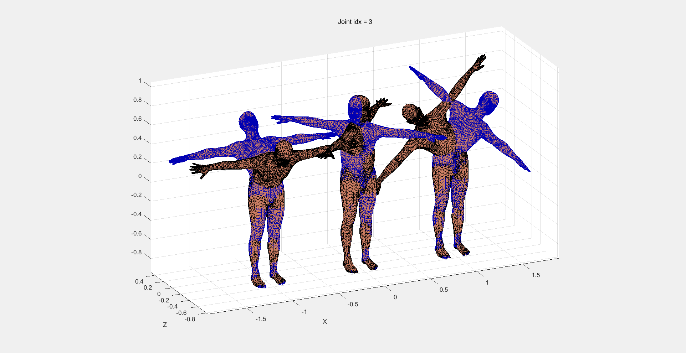
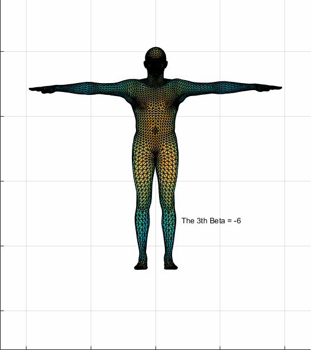

#! https://zhuanlan.zhihu.com/p/137235901
<!--
 * @Author: 卫炜
 * @Date: 2020-04-26 11:22:44
 * @LastEditTime: 2020-04-29 15:52:49
 * @LastEditors: Please set LastEditors
 * @Description: In User Settings Edit
 * @FilePath: \专栏\Untitled-1.md
 -->
# SMPLify-x 基本讲解

## 任务
通过输入一张RGB的人体图像和由openpose检测出的人体关键点来重建人体的三维模型，其中包含肢体的动作、人脸的表情和手部动作，如图所示：

## SMPL简介
SMPL-x是德国马普所基于过去的smpl模型升级而来，所以这里先介绍SMPL模型。SMPL模型可以使用一个85维的向量来表示，其中包含人体关键点信息72维，体型信息10维，摄像机位置参数3维。

###  人体关键点信息
SMPL中包含共24个人体关键点，每个关键点信息由三个数字组成，所以总共72维，用$\theta$表示。其中每个点的三个数字表示的时肢体旋转的三个角度（yaw，roll，pitch）而不是坐标，如下图所示：

通过肢体的旋转可以表示任意动作，但是不一定都合理。同时提供了SMPLify方法用于从一张RGB的人体图像和由openpose检测出的人体关键点来建立有相同体型和动作的SMPL模型。

### 体型信息
SMPL预设了很多种体型，并通过10个数字的组合去选择不同的体型来拟合图像的任务，用$\beta$表示，如下图所示：

## SMPL-x简介
在SMPL模型的基础上，增加了对人脸和手部的模型，保持了以下优点：
- 与图形软件兼容
- 参数简单
- 尺寸小
- 高效
- 可微分
与SMPL相同，SMPL-x同样提供了直接从RGB图像和关键点得到模型的方法SMPLify-x。

## SMPLify-x简介
SMPLify-x的大致流程如下：

1. 使用openpose检测一张RGB图像上得人体骨骼关键点，手部关键点和人脸关键点
2. 使用smpl-x模型去拟合第1步检测出的关键点数据

### smplify-x比smplify的提升
- 使用变分自编码器（VAE）在MoCap数据集中学习了一个新的，表现更好的动作先验。因为从2d到3d的映射是非常模糊暧昧的，所以这种先验非常重要
- 定义了一个新的互穿惩罚项（interpenetration penalty term），比smplify中的近似方法更准确有效
- 训练了一个性别检测器，判断该用哪套模型（模型分为男性女性和中性）
- 使用pytorch实现训练直接回归smpl-x参数，比之前的smplify中使用chumpy快8倍

### 评估数据集
建立了一个评估数据集，包含各种人体和动作，使用扫描系统捕获人体形状，再将smpl-x拟合到扫描中

## SMPL-x讲解
smpl-x表面总计$N$=10475个角点（vertices），由$K$=54个关键点控制。若由数学公式来表达，smpl-x模型可以表达为
$$
M(\theta,\beta,\psi)=W(T_p(\beta,\theta,\psi), J(\beta),\theta,\omega)
$$
其中$\theta$表示动作参数每个参数表示相对于父节点的旋转关系（yaw，roll，pitch），$\theta\in R^{3(K+1)}$，$K+1$是因为除了上面提到的K个关键点，还有一个用于控制整个身体的旋转。其中的$\theta$可以分为以下三类：$\theta_f$是脸部的脸部关键点（jaw joint），$\theta_h$是手指的关节点，$\theta_b$是肢体上的关键点。另外公式中的$\beta$参数用来表示人的体型，$\psi$参数用来表示面部表情。整个操作的意义就是输入以上三种参数，最终输出人体3d模型表面上每一个顶点的坐标，即$M(\theta,\beta,\psi)\in R^{3N}$,每个顶点都是一个三维坐标，所以是$3N$。

接下来解释$W$中每个部分的意义：

$$
T_p(\beta,\theta,\psi)=\overline{T}+B_S(\beta;S)+B_E(\psi;\varepsilon)+B_P(\theta;P)
$$
$$
B_S(\beta;S)=\sum_{n=1}^{|\beta|}\beta_nS_n
$$
$$
B_E(\psi;\varepsilon)=\sum_{n=1}^{|\psi|}\psi_n\varepsilon_n
$$
$$
B_P(\theta;P)=\sum_{n=1}^{9K}(R_n(\theta)-R_n(\theta^*))P_n
$$
$$
J(\beta)=\bf{J}(\overline{T}+B_S(\beta;S))
$$
其中的$T_p$表示在平均模型$\overline{T}$的基础上，分别经过体型、动作和表情参数修正之后的人体模型。$B_S(\beta;S)$、$B_E(\psi;\varepsilon)$和$B_P(\theta;P)$分别代表了体型、动作和表情参数计算出的在平均模型上的修正数据。其中的$S$、$\varepsilon$和$P$分别是模型表面顶点位移的正交分量。

注意，这里的$\overline{T}$其实就是预设好的人体模型，$\overline{T}+B_S(\beta;S)+B_E(\psi;\varepsilon)$表示依据体型和表情参数去修改人体模型，将模型的外观依照参数去形变成需要的样子，再加上$B_P(\theta;P)$并不是说在此时就要给模型加上参数所示的动作了，而是在预设的动作（T pose）上依据将要做出的动作再次改变形体。

例如一个比较胖的人，腹部有赘肉，那么在下腰这个动作时腹部的赘肉就会层叠起来，这时$\overline{T}+B_S(\beta;S)+B_E(\psi;\varepsilon)$就是将这个将模型的体型修正得比较胖，而下腰时腹部赘肉的层叠则由$B_P(\theta;P)$来进行修正。以上这些操作都是在改变模型的体型，均没有改变模型的动作。

$J(\beta)=\bf{J}(\overline{T}+B_S(\beta;S))$表示从模型的表面顶点中获取每个关键点的坐标。

最终$M(\theta,\beta,\psi)=W(T_p(\beta,\theta,\psi), J(\beta),\theta,\omega)$就表示将修正好的形体在关键点处进行旋转再辅以形变权重$\omega$，最终得到我们需要的带有动作的人体模型出来。

SMPL-x的输入参数总共119个，其中75个人体关键点信息（（24+1）×3），24个手部动作信息（经过PCA降维，原本应该是90个，用$m_h$表示），10个体型信息和10个表情信息。

## SMPLify-x讲解
smplify-x是smpl-x的一种实现，主要功能就是从一张RGB图像和openpose的关节点上直接得到具有当前人体体型、动作和表情的模型。主要方式是从图像上计算目标函数的最小值：
$$
E(\beta,\theta,\psi)=E_J+\lambda_{\theta_b}E_{\theta_b}+\lambda_C E_C+\lambda_\alpha E_\alpha+\lambda_{\theta_f}E_{\theta_f}+\lambda_{m_h}E_{m_h}
+\lambda_\beta E_\beta+\lambda_\varepsilon E_\varepsilon
$$
其中的$\lambda_{\theta_f}E_{\theta_f}$、$\lambda_{m_h}E_{m_h}$、$\lambda_\beta E_\beta$和$\lambda_\varepsilon E_\varepsilon$是手部动作，脸部动作（jaw），体型和面部表情的L2正则项。
>原文这里的表述是：
 $E_J(\beta,\theta,K,J_{est})$ is the data term as described below, while the terms $E_{m_h}$, $E_{\theta_f}$, $E_\beta$ and $E_\varepsilon$ are simple L2 priors for the hand pose, facial pose, body shape and facial expressions, penalizing deviation from the neutral state. Since the shape space of SMPL-X is scaled for unit variance, similarly to [68], $E_\beta=||\beta||^2$ describes the Mahalanobis distance between the shape parameters being optimized and the shape distribution in the training dataset of SMPL-X.
 这里的表述比较复杂，但是从公式的表达形式来说与岭回归相似，故就说成是L2正则项，如理解有误欢迎提出。

$E_\alpha=\sum_{i\in(elbows,knees)}exp(\theta_i)$表示一个用于膝盖和肘部弯曲的简单先验，大概的意义就是人的膝盖和肘部只能向一个方向弯曲，在数据$\theta$中即只能向负方向弯曲，所以当$\theta_i$为正时会让整个公式变大，由此给予惩罚。

$E_J(\beta,\theta,K,J_{est})=\sum_{joint\ i}\gamma_i \omega_i \rho(\Pi_K(R_\theta(J(\beta))_i)-J_{est,i})$表示一个重投影损失。其中$J(\beta)$表示表示从模型的表面顶点中获取每个关键点的坐标，$R_\theta(J(\beta))_i$表示依据动作参数$\theta$给每个关键点做出旋转，从而得到符合当前动作的每个关键点的坐标。$\Pi_k$表示按照摄像机的位置将每个关键点的三维坐标投影到二维，再减去由openpose预测出的每个关键点二维坐标$J_{est}$。考虑到检测过程中的噪声，每个关键点对于公式的贡献由检测置信分数$\omega_i$加权得到，$\gamma_i$对于每个关节的权重进行优化，$\rho$表示一个鲁棒Geman-McClure误差方程，常用于图像匹配，用于比对openpose和预测关键位置的偏差。

身体的先验除了前面的提到的膝盖和肘部之外还有很多（毕竟很多动作都是人根本做不出来的），所以必须还要有一个全身的先验，用来惩罚那些检测出的根本做不来的动作。前人的smplify使用在MoCap数据上训练的高斯混合模型的负对数近似，有效，但是还不够强大。所以smplify-x使用变分自编码器（VAE）训练了一个全身先验VPoser。Vposer学习了一个潜码（latent code）来表示人体的动作并将其正则化为正态分布。目标函数中的$\lambda_{\theta_b}E_{\theta_b}$同样是一个正则项，但是其中的$\theta_b$表示的是一个函数$\theta_b(Z)$，其中$Z\in R^{32}$表示一个低维的动作空间，也就是上述Vposer学到的潜码。VAE的损失函数如下所示：
$$
L_{total}=c_1L_{KL}+c_2L_{rec}+c_3L_{orth}+c_4L_{det1}+c_5L_{reg}
$$
$$
L_{KL}=KL(q(Z|R)||N(0,I))
$$
$$
L_{rec}=||R-\widehat{R}||_2^2
$$
$$
L_{orth}=||\widehat{R}\widehat{R}'-I||_2^2
$$
$$
L_{det1}=|det(\widehat{R})-1|
$$
$$
L_{reg}=||\phi||_2^2
$$
其中$Z\in R^{32}$是自编码器的隐空间，$R$表示每一个关键点的旋转矩阵，这也是VAE网络的输入，$\widehat{R}$是网络的输出。$L_{KL}$表示KL散度，用于衡量训练之后的分布与正态分布之间的度量。$L_{rec}$遵循VAE公式。$L_{KL}$和$L_{rec}$的作用是保证训练结果的正态分布并保证由潜码重建之后的效果与之前的相符。$L_{orth}$和$L_{det1}$保证VAE对于旋转矩阵进行编码。$L_{reg}$防止过拟合。

最后一个$E_C$用来表示一个互穿惩罚。因为在实际的拟合过程中，通常会发生身上的几个部位互相穿透（俗称穿模）的情况，smplify是基于图元的碰撞模型来进行惩罚，这种方法比较有效，但只是对于人体的基础近似。而smplify-x还要对手部和面部进行预测，所以更需要更加精确的碰撞模型。这里借鉴了《Motion capture of hands in action using discriminative salient points》和《Capturing hands in action usintg discriminative salient points and physcis simulation》的细节的基于碰撞的表面模型。首先使用BVH检测一系列碰撞三角形$C$（模型的表面都是一个个顶点组成的三角形），然后由三角形$C$及其法线$n$计算局部圆锥3d距离场$\Psi$。接着由距离场中的位置计算入侵深度并对侵入进行惩罚。对于两个碰撞的三角形$f_s$和$f_t$，它们的侵入是互相的，在$f_s$的距离场$\Psi_{f_s}$中，$f_t$上的顶点$v_t$是侵入者，而$f_s$则是接受者，其应该由$\Psi_{f_s}(v_t)$进行惩罚，反之亦然。所以$E_C$的公式如下：
$$
E_c(\theta)=\sum_{(f_s(\theta),f_t(\theta))\in C}(\sum_{v_s\in f_s}||-\Psi_{f_t}(v_s)n_s||^2+\sum_{v_t\in f_t}||-\Psi_{f_s}(v_t)n_t||^2)
$$

## 性别分类器
为了拟合得更加准确，需要先知道照片上的人的性别，这样才能更好的选择预设模型。smplify-x训练了一个分类器，将包含全身的图像和openpose关键点输入，使用Resnet18进行训练，最终输出性别概率。若最终输出的性别概率均低于阈值，则直接使用中性模型。

## 优化过程
之前的smplify采用chumpy和OpenDR进行优化，但是优化速度非常慢（而且在python3上配环境很麻烦），所以这一次的smplify-x采用pytorch和L-BFGS进行有强Wolfe条件的线搜索。在优化中采用多级优化。首先假设我们已知相机焦距的确切值或者近似值，估计相机的平移和身体的方位（与smplify相同）。然后固定相机参数，优化体型参数$\beta$和动作参数$\theta$。这里采用退火方案来处理局部最优解（表现在$\gamma$上），先提高肢体动作部分的$\gamma$值来计算肢体的动作，再提升手部的$\gamma$值计算手部和胳膊的参数，接着提升双手和脸部。在优化过程中肢体、手部、脸部表情的$\gamma$都是先高后低，但是$E_c$会逐渐增大，因为手部的$\gamma$变大之后会产生更多的穿透。

>参考资料
 https://zhuanlan.zhihu.com/p/105216364
 http://blog.sciencenet.cn/blog-465130-1177111.html
 https://blog.csdn.net/chenguowen21/article/details/82793994
 Loper M , Mahmood N , Romero J , et al. SMPL: a skinned multi-person linear model[C]// ACM SIGGRAPH Asia Conference. ACM, 2015.
 Pavlakos G , Choutas V , Ghorbani N , et al. Expressive Body Capture: 3D Hands, Face, and Body from a Single Image[J]. Proceedings / CVPR, IEEE Computer Society Conference on Computer Vision and Pattern Recognition. IEEE Computer Society Conference on Computer Vision and Pattern Recognition, 2019.
 Bogo F , Kanazawa A , Lassner C , et al. Keep it SMPL: Automatic Estimation of 3D Human Pose and Shape from a Single Image[J]. 2016.
