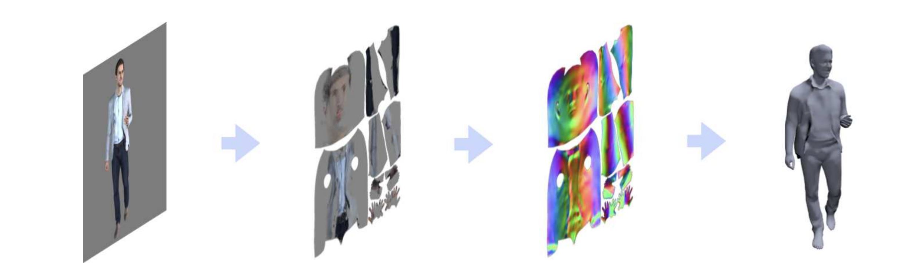
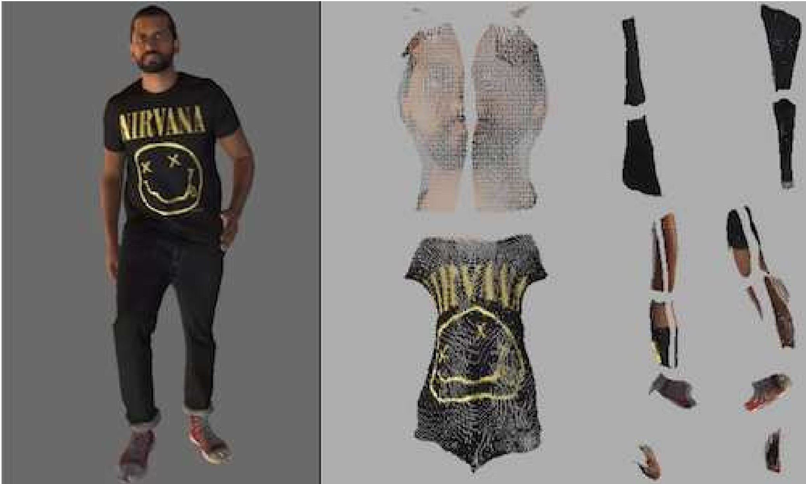
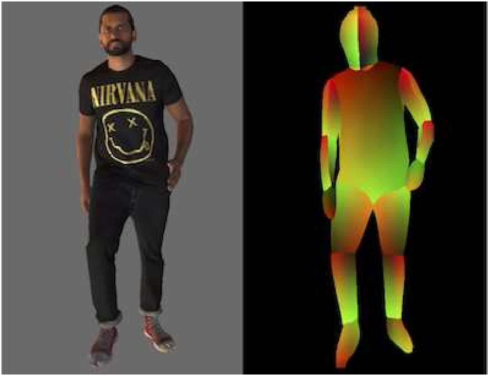
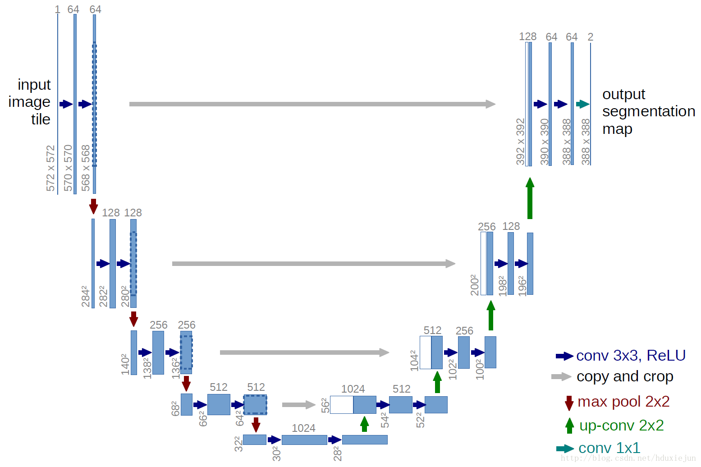

#! https://zhuanlan.zhihu.com/p/137784567
<!--
 * @Author: your name
 * @Date: 2020-05-01 20:38:30
 * @LastEditTime: 2020-05-02 17:09:50
 * @LastEditors: Please set LastEditors
 * @Description: In User Settings Edit
 * @FilePath: \undefinedc:\Users\conan\Desktop\LongTime\专栏\tex2shape基本讲解\tex2shape.md
 -->
# Tex2Shape 基本讲解

## 任务
&emsp;&emsp;从一张RGB图像得到带有服装细节的3D人体模型



## 基本思路
&emsp;&emsp;将一个形状回归的问题转变为了对齐的图像到图像的转化问题。基本步骤如下：
- 在一张有完整人体的RGB图像上使用Densepose获取人体的IUV图像，建立可见人体像素与3D人体模型表面顶点的关系。
- 训练一个生成器，由UV图像获得每个像素从3D模型的平滑人体表面到衣服纹理移动所需的法线和位移矢量，即Tex2Shape
- 将生成器所得的带有法线和位移矢量的的UV图应用于SMPL模型，得到带有衣服纹理的3D人体图像。

## 主要贡献
- 将一个复杂的全身形状重构问题转变为一种更容易的3D姿势无关的图像到图像的转换问题，这是目前学界第一次采用这种方法
- 可以以50 fps的速度完成转换
- 简单有效，可以推广到其他研究

## 名词解释

### SMPL
&emsp;&emsp;可以参见我的上一篇文章。本文中的Tex2Shape是一种与3D姿势无关的形体回归方法，所以只需要获得代表体型的$\beta$参数即可。

### UV图和UV映射
&emsp;&emsp;UV图是一种广泛应用于图形化软件中的一种概念。例如下图：

例如左图是一个3D的人体模型，右图就是将其表面给铺平开来，形成了一张展平的纹理图像。已知3D模型的表面上每个点都需要一个三维坐标（x，y，z）来表示其位置，那么在纹理图像上，我们同样建立一个UV空间，将横坐标记为u坐标，纵坐标记为v坐标（其实跟二维的xy坐标是一样的，只是x和y已经被用了，所以改成uv）。这时就可以建立一个从UV空间到XYZ空间的映射关系，即将展平的纹理图像上每个像素点都“贴”到3D模型上，这种映射关系就称之为UV映射。（多数情况下会把UV的坐标值归一化在0到1之间）

### Densepose
&emsp;&emsp;Densepose是来自Facebook AI研究室的经典网络。其用深度学习把2D图像坐标映射到3D人体表面上，通俗来讲就是在一张人体图像上计算假如把这个人的表皮（连带衣服）展开的话，每个像素点应该的UV坐标。例如下图：

右图即为Densepose的输出，这张输出的图像上每个像素点都有三个通道，分别代表的意思是：

- 人体的分块（I）

&emsp;&emsp;&emsp;Densepose将人体分为24个部分（头、躯干、大腿、小腿等，从图中颜色的边界上大概能看出来），这个通道的数值也就是从1到24，由I表示。

- U坐标

&emsp;&emsp;&emsp;第二个通道是假如将人体的表皮连带衣服展平的话（二向箔之后的人体w(ﾟДﾟ)w），当前这个像素的U坐标应该的值，这里需要将其除以256从而归一化到0到1。

- V坐标

&emsp;&emsp;&emsp;第三个通道是假如将人体的表皮连带衣服展平的话，当前这个像素的V坐标应该的值，同样需要将其除以256从而归一化到0到1。

本文所述的在运行时就需要将上图所示的原图和由Densepose所得的IUV图像输入。

## 网络结构及训练

### 网络结构
&emsp;&emsp;包含两种CNN网络，一种是由Denspose输出的IUV图像和原始图像生成的纹理图作为输入，预测出SMPL模型上的法线和位移，称为Tex2Shape；另一种是由IUV图像预测出SMPL的$\beta$参数，称为$\beta$-网络。

- Tex2Shape

&emsp;&emsp;其实是一个比较典型的pix2pix的条件生成对抗网络（cGAN），其原本的任务是由语义分割图生成自然图像。主要由一个U-net生成器和PatchGAN鉴别器组成。

&emsp;&emsp;U-net原本用于医学语义分割，是一个比较典型的编解码结构。如下图所示，下采样和上采样部分均有四个采样层，同时还有一个独特的skip connection结构，即每个下采样层获得的特征图（feature map）都会拼接到对应的上采样层，这样的目的是将每个下采样层的特征图用到后续的计算中，以弥补可能丢失的信息，这种方式使得高级特征图能够结合低级特征图的特征，实现了不同scale下特征的融合，便于提升模型精度。

在Tex2Shape中作者做了部分改动，上采样和下采样部分各自使用了7个采样层，每个采样层由一个CNN+LeakyRelU+BatchNorm组成

&emsp;&emsp;PatchGAN是一个GAN的判别器。它与其他判别器不同的是：普通的GAN判别器只会输出一个实数，即输入样本为真样本的概率；PatchGAN是将输出映射为一个N×N的矩阵，矩阵的每一个值代表输入中的一个感受野为真样本的概率。为了便于理解，可以参考如下代码：
```
def f(output_size, ksize, stride):
    return (output_size - 1) * stride + ksize

# 现在来从PatchGAN的输出中的每一个数值往回看，计算其所代表的上一层特征图的感受野大小
last_layer = f(output_size=1, ksize=4, stride=1)
# Receptive field: 4
fourth_layer = f(output_size=last_layer, ksize=4, stride=1)
# Receptive field: 7
third_layer = f(output_size=fourth_layer, ksize=4, stride=2)
# Receptive field: 16
second_layer = f(output_size=third_layer, ksize=4, stride=2)
# Receptive field: 34
first_layer = f(output_size=second_layer, ksize=4, stride=2)
# Receptive field: 70

print(f'最后一层感受域大小:{last_layer}')
print(f'第一层感受域大小:{first_layer}')
#最后一层感受域大小:4
#第一层感受域大小:70

代码链接：https://blog.csdn.net/weixin_35576881/article/details/88058040
```
在本工作中作者将PatchGAN的结构改为与U-net相同的四个下采样层。

- $\beta$网络

$\beta$网络使用1024×1024的DensePose输出的IUV图作为输入，与U-net相同的7个CNN+LeakyRelU+BatchNorm组成，最后再加一个全连接层将结果映射为一个10维的向量。

### Loss
Tex2Shape的loss在pix2pix的基础（原始GAN的loss，L1-loss）上还加入了多尺度结构相似性指数（MS-SSIM），及在不同尺度下检测特征图的相似性（这也是为什么U-net和PatchGAN单层结构相似的原因）。$\beta$网络则采用L2-loss。两个网络均采用Adam Optimizar。